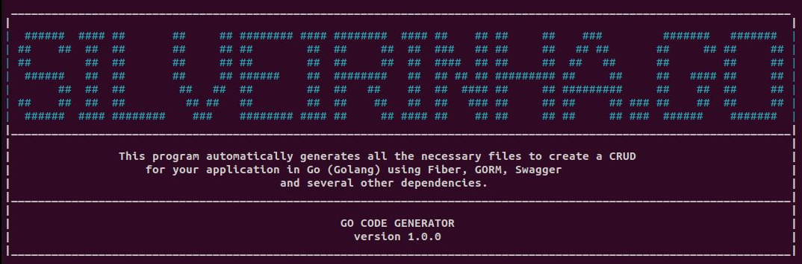

# silveirinha

<p align="center">
  
</p>

<p align="center">
  
</p>

## PT-BR

`silveirinha` é uma ferramenta de linha de comando projetada para ajudar a gerar projetos Go e modelos de maneira fácil e rápida. Inclui comandos como `silveirinha create` para criar projetos e `silveirinha model` para gerar modelos. Esta ferramenta é ideal para agilizar o desenvolvimento e seguir boas práticas em suas aplicações Go.

## EN-US

`silveirinha` is a command-line tool designed to help quickly generate Go projects and models. It includes commands like `silveirinha create` to create projects and `silveirinha model` to generate models. This tool is ideal for speeding up development and following best practices in your Go applications.

## ES-ES

`silveirinha` es una herramienta de línea de comandos diseñada para ayudar a generar proyectos Go y modelos de manera rápida y fácil. Incluye comandos como `silveirinha create` para crear proyectos y `silveirinha model` para generar modelos. Esta herramienta es ideal para agilizar el desarrollo y seguir buenas prácticas en tus aplicaciones Go.

### Instalação / Installation / Instalación

#### Pré-requisitos / Prerequisites / Requisitos previos

- **Go 1.23** ou superior / **Go 1.23** or higher / **Go 1.23** o superior

#### Instalando a ferramenta `silveirinha` / Installing the `silveirinha` Tool / Instalando la herramienta `silveirinha`

## PT-BR
Para instalar a ferramenta `silveirinha` globalmente em sua máquina, execute o seguinte comando:

## EN-US
To install the `silveirinha` tool globally on your machine, run the following command

## ES-ES
Para instalar la herramienta `silveirinha` globalmente en su maquina, ejecute el siguiente comando:

```bash
go install github.com/lucassilveira96/silveirinha@latest
```

### uso / usage / uso

## PT-BR
Para usar a ferramenta `silveirinha` e criar um novo projeto, execute o seguinte comando:

## EN-US
To use the `silveirinha` tool to create a new project, run the following command:

## ES-ES
Para usar la herramienta `silveirinha` para crear un nuevo proyecto, ejecute el siguiente comando:

```bash
silveirinha create my-new-project
```
## PT-BR
Para usar a ferramenta `silveirinha` e criar um nova model entre na pasta do projeto criado, execute o seguinte comando:

## EN-US
To use the `silveirinha` tool to create a new model in the created project folder, run the following command:

## ES-ES
Para usar la herramienta `silveirinha` para crear un nuevo modelo en la carpeta del proyecto creado, ejecute el siguiente comando:

```bash
silveirinha model modelExample
```

## Contribuicoes / Contributions / Contribuciones

## PT-BR
Se vocês gostariam de contribuir com a ferramenta `silveirinha`, sinta-se a vontade para abrir um pull request no repositório do GitHub: https://github.com/lucassilveira96/silveirinha

## EN-US
If you would like to contribute to the `silveirinha` tool, feel free to open a pull request in the GitHub repository: https://github.com/lucassilveira96/silveirinha

## ES-ES
Si quieres contribuir con la herramienta `silveirinha`, no dudes en abrir un pull request en el repositorio de GitHub: https://github.com/lucassilveira96/silveirinha